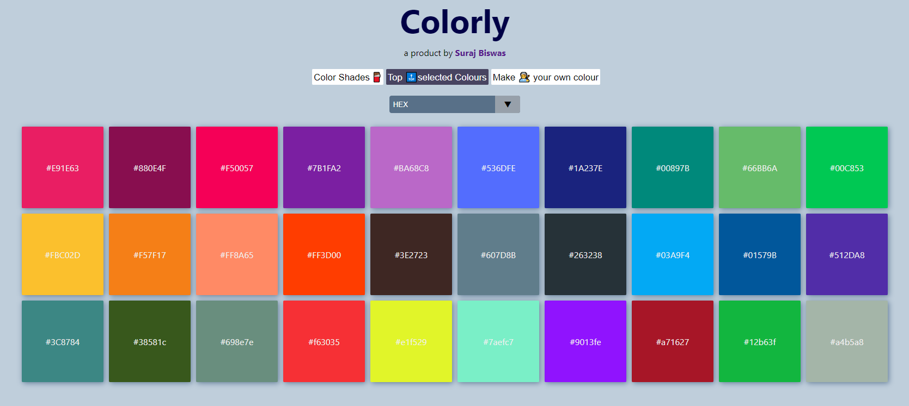

# Colorly :art

I build this project so it can be used by frontend developers and designers in everyday work

## Connect with me :dart: :point_down:

[:red_circle: Instagram](https://www.instagram.com/iamsuraj_dev/)

[:red_circle: LinkedIn](https://www.linkedin.com/in/suraj-biswas-824bb4176/)

[:red_circle: YouTube](https://www.youtube.com/channel/UClS_wbN0kW0KtVop9EgZLAg)

## Why you should you use [Colorly](https://colorlyui.netlify.app/) ?

1. You can pick some amazing handpicked colors
2. you can make your own color
3. you can take colors from shade card

- :fire: Bonus Points
- :four_leaf_clover: you can choose between HEX code and RGB values
- :four_leaf_clover: One click easy copy

# Screen shot of [Colorly](https://colorlyui.netlify.app/)

# Build with :muscle:

1. [React js](https://reactjs.org/)
2. [React Color](https://www.npmjs.com/package/react-color)
3. [React Toastify](https://www.npmjs.com/package/react-toastify)

## How to run this project

### `clone this repo or download it`

In the project directory, you can run:

### `npm install`

To install all the packages to run the project

### `npm start`

Runs the app in the development mode. 
Open [http://localhost:3000](http://localhost:3000) to view it in the browser.

The page will reload if you make edits. 
You will also see any lint errors in the console.

## Please give this repo a star :star: it will motivate me more thank you
